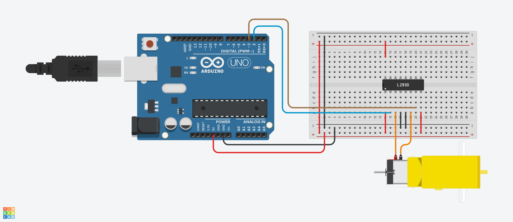

# L293D con Arduino
Práctica de robótica en la que aprenderemos a controlar un motor DC con un circuito integrado L293D y Arduino

## Materiales
* 1 x Arduino Uno
* 1 x Motor DC
* 1 x CI L293D
* 1 x Protoboard
* Cables Dupont o puentes para protoboard

## Layout
